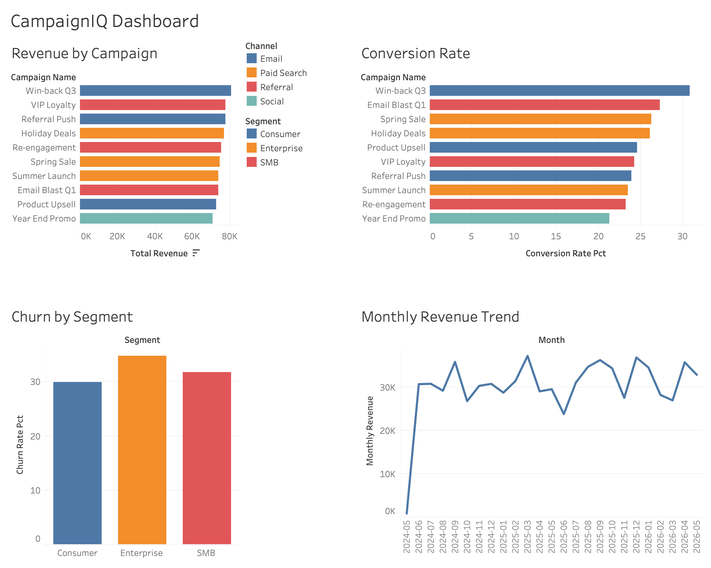

# CampaignIQ: Marketing Analytics & Reporting Dashboard

An end-to-end marketing analytics project that analyzes customer behavior, campaign performance, churn trends, and revenue patterns using SQL, Python, and Tableau.

## Project Overview
This project simulates a real-world marketing analytics workflow from raw data generation to interactive dashboard, designed to surface actionable insights for business stakeholders.

## Tech Stack
- **Python** (Pandas, NumPy, Matplotlib, Seaborn) - data generation, cleaning, analysis
- **SQL** (SQLite) - querying, joining, and aggregating data across multiple tables
- **Tableau** - interactive dashboard with drill-down visualizations
- **Git** - version control

## Dataset
Synthetic dataset generated to mirror real marketing data:
- 500 customers across 4 regions and 3 segments (Enterprise, SMB, Consumer)
- 10 campaigns across 4 channels (Email, Paid Search, Referral, Social)
- 3,000 customer interactions over 2 years

## Key SQL Queries
- Revenue and conversion rate by campaign
- Churn rate and average lifetime value by customer segment
- Revenue breakdown by region
- Monthly revenue trend over time

## Key Insights
- Win-back Q3 generated the highest revenue ($80,877) and highest conversion rate (30.79%)
- Enterprise segment had the highest churn rate at 34.64%
- South region led all regions in total revenue at $198,001
- Monthly revenue showed consistent performance between $25K and $35K after ramp-up

## Dashboard

## Project Structure
CampaignIQ/
- generate_data.py       Synthetic data generation
- analyze.py             SQL queries, Python analysis, charts
- queries.sql            All SQL queries
- data/                  Raw CSV files and SQLite database
- outputs/               Query results and charts
- dashboard.png          Tableau dashboard screenshot

## How to Run
Step 1 - Generate data:
python3 generate_data.py

Step 2 - Run analysis and generate charts:
python3 analyze.py
